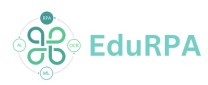

<p align="center">
  
</p>

## Description

EduRPA is a platform for creating and sharing RPA workflows. It is built on top of [Nest](https://docs.nestjs.com/) framework.

## Installation

```bash
$ npm install
```

## Running the app

```bash
# development
$ npm run start

# watch mode
$ npm run start:dev

# production mode
$ npm run start:prod
```

## API Documentation
Swagger API documentation is available at `/api` route.

## Test

```bash
# unit tests
$ npm run test

# e2e tests
$ npm run test:e2e

# test coverage
$ npm run test:cov
```

## Authors
- Nguyen Quang Khanh
- Huynh Dai Vinh
- Nguyen Duc An
